# 和它交个朋友 · 用户端流程文档

| 项目 | 说明 |
|------|------|
| 关联文档 | [需求文档.md](./需求文档.md) |
| 文档版本 | v1.0 |
| 更新日期 | 2026-06-26 |

**相关文档：** [需求文档.md](./需求文档.md) · [后端需求文档.md](./后端需求文档.md) · [整改计划.md](./整改计划.md)

---

## 1. 文档说明

本文档在《需求文档》基础上，描述用户端 **页面跳转关系、业务操作流程、状态流转与异常分支**，供产品、设计、开发、测试联调使用。

**图例约定：**

| 符号 | 含义 |
|------|------|
| 菱形 | 判断/分支 |
| 矩形 | 页面或操作 |
| 圆角矩形 | 开始/结束 |
| 虚线框 | 可选路径或后台处理 |

---

## 2. 应用总览流程

### 2.1 启动与 Tab 导航

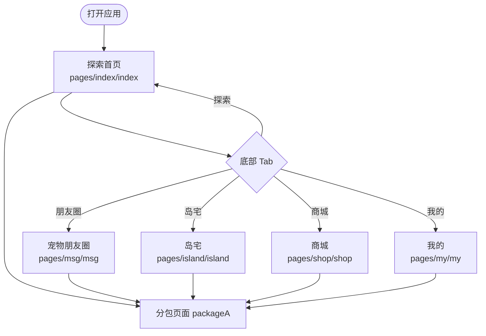
```mermaid
flowchart TD
    Start([打开应用]) --> Index[探索首页<br/>pages/index/index]
    Index --> Tab{底部 Tab}
    Tab -->|探索| Index
    Tab -->|朋友圈| Msg[宠物朋友圈<br/>pages/msg/msg]
    Tab -->|岛宅| Island[岛宅<br/>pages/island/island]
    Tab -->|商城| Shop[商城<br/>pages/shop/shop]
    Tab -->|我的| My[我的<br/>pages/my/my]

    Index --> SubPages[分包页面 packageA]
    Msg --> SubPages
    Island --> SubPages
    Shop --> SubPages
    My --> SubPages
```

### 2.2 登录拦截通用流程

所有需登录操作统一经 `ensureLogin()` 拦截：

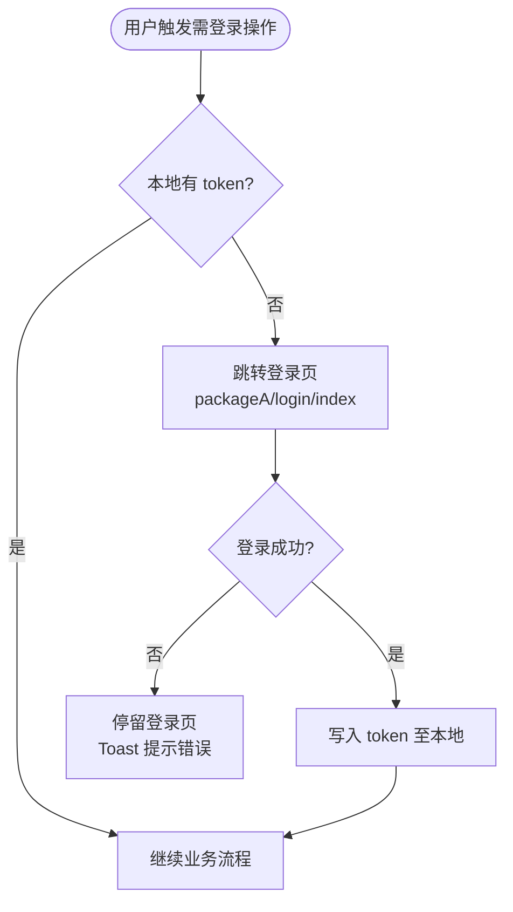
```mermaid
flowchart TD
    Action([用户触发需登录操作]) --> Check{本地有 token?}
    Check -->|是| Proceed[继续业务流程]
    Check -->|否| Login[跳转登录页<br/>packageA/login/index]
    Login --> LoginOk{登录成功?}
    LoginOk -->|是| SaveToken[写入 token 至本地]
    SaveToken --> Proceed
    LoginOk -->|否| StayLogin[停留登录页<br/>Toast 提示错误]
```

**触发登录拦截的典型场景：** 点赞、评论、发布动态、投诉、投喂、集市购买、打榜、领养申请、我的页菜单、支付等。

---

## 3. 账号体系流程

### 3.1 登录流程

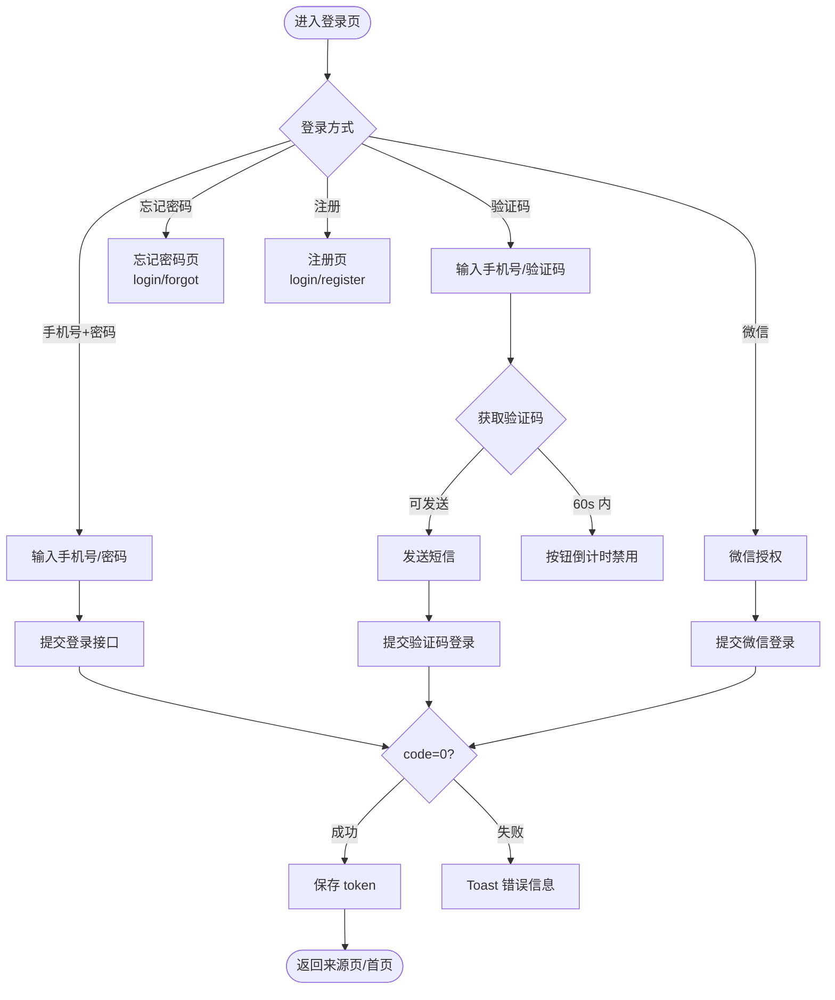
```mermaid
flowchart TD
    Enter([进入登录页]) --> Mode{登录方式}
    Mode -->|手机号+密码| Pwd[输入手机号/密码]
    Mode -->|验证码| Code[输入手机号/验证码]
    Mode -->|微信| Wx[微信授权]
    Mode -->|忘记密码| Forgot[忘记密码页<br/>login/forgot]
    Mode -->|注册| Register[注册页<br/>login/register]

    Pwd --> Submit1[提交登录接口]
    Code --> SendCode{获取验证码}
    SendCode -->|60s 内| Wait[按钮倒计时禁用]
    SendCode -->|可发送| Sms[发送短信]
    Sms --> Submit2[提交验证码登录]
    Wx --> Submit3[提交微信登录]

    Submit1 --> Result{code=0?}
    Submit2 --> Result
    Submit3 --> Result
    Result -->|成功| Token[保存 token]
    Token --> Back([返回来源页/首页])
    Result -->|失败| Toast[Toast 错误信息]
```

### 3.2 注册与找回密码

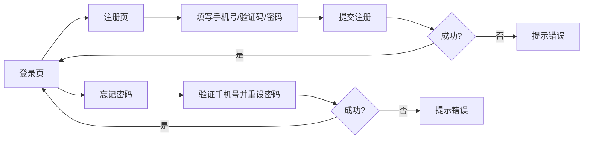
```mermaid
flowchart LR
    Login[登录页] --> Register[注册页]
    Register --> Fill[填写手机号/验证码/密码]
    Fill --> RegSubmit[提交注册]
    RegSubmit --> RegOk{成功?}
    RegOk -->|是| Login
    RegOk -->|否| Toast1[提示错误]

    Login --> Forgot[忘记密码]
    Forgot --> Reset[验证手机号并重设密码]
    Reset --> ForgotOk{成功?}
    ForgotOk -->|是| Login
    ForgotOk -->|否| Toast2[提示错误]
```

### 3.3 退出与注销

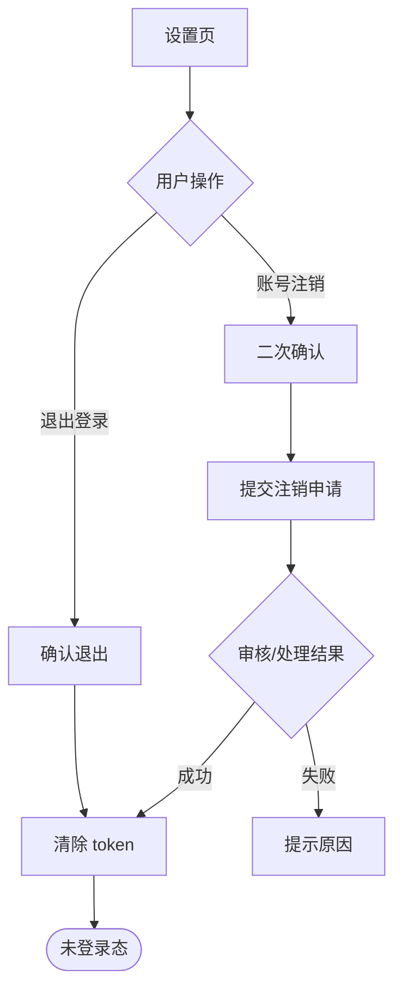
```mermaid
flowchart TD
    Settings[设置页] --> LogoutChoice{用户操作}
    LogoutChoice -->|退出登录| Confirm1[确认退出]
    Confirm1 --> ClearToken[清除 token]
    ClearToken --> Guest([未登录态])

    LogoutChoice -->|账号注销| Confirm2[二次确认]
    Confirm2 --> CancelApply[提交注销申请]
    CancelApply --> CancelResult{审核/处理结果}
    CancelResult -->|成功| ClearToken
    CancelResult -->|失败| Toast[提示原因]
```

---

## 4. 探索（首页）流程

### 4.1 首页浏览与跳转

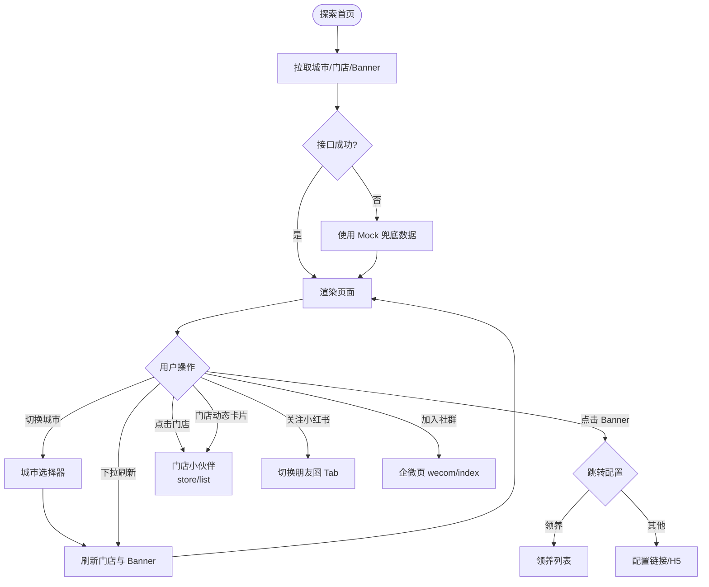
```mermaid
flowchart TD
    Home([探索首页]) --> Load[拉取城市/门店/Banner]
    Load --> Fail{接口成功?}
    Fail -->|否| Mock[使用 Mock 兜底数据]
    Fail -->|是| Render[渲染页面]
    Mock --> Render

    Render --> Actions{用户操作}
    Actions -->|切换城市| CityPicker[城市选择器]
    CityPicker --> Reload[刷新门店与 Banner]
    Reload --> Render

    Actions -->|点击 Banner| BannerLink{跳转配置}
    BannerLink -->|领养| AdoptList[领养列表]
    BannerLink -->|其他| WebOrPage[配置链接/H5]

    Actions -->|点击门店| StoreList[门店小伙伴<br/>store/list]
    Actions -->|门店动态卡片| StoreList
    Actions -->|关注小红书| MsgTab[切换朋友圈 Tab]
    Actions -->|加入社群| Wecom[企微页 wecom/index]
    Actions -->|下拉刷新| Reload
```

---

## 5. 朋友圈流程

### 5.1 动态浏览与互动

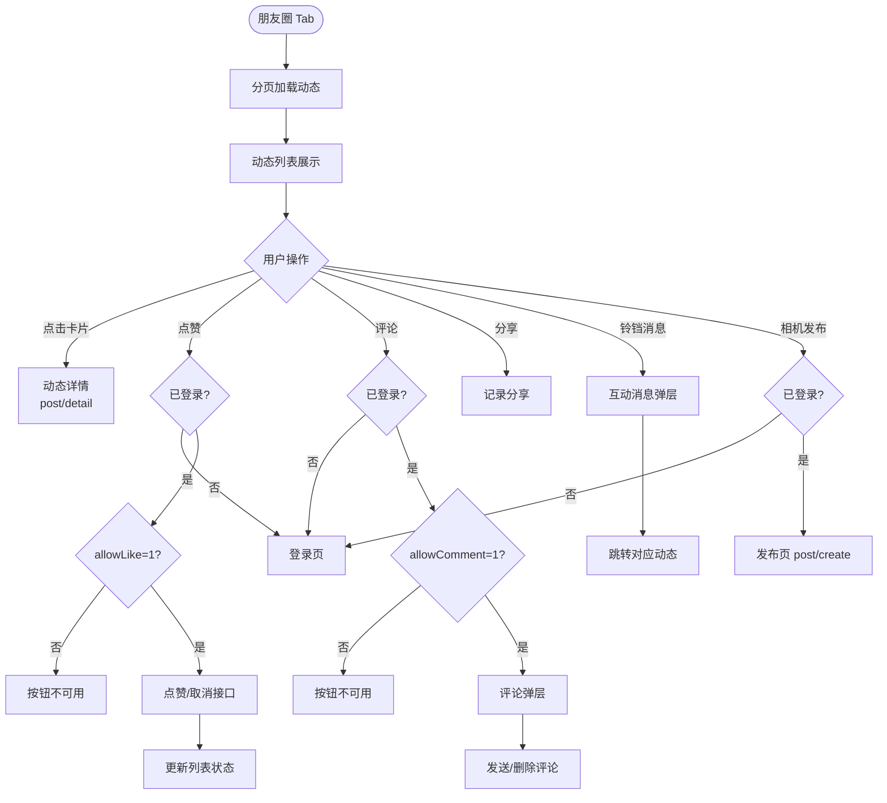
```mermaid
flowchart TD
    Feed([朋友圈 Tab]) --> LoadPosts[分页加载动态]
    LoadPosts --> List[动态列表展示]

    List --> Op{用户操作}
    Op -->|点击卡片| Detail[动态详情<br/>post/detail]
    Op -->|点赞| Login1{已登录?}
    Login1 -->|否| LoginPage[登录页]
    Login1 -->|是| AllowLike{allowLike=1?}
    AllowLike -->|否| Disabled1[按钮不可用]
    AllowLike -->|是| ToggleLike[点赞/取消接口]
    ToggleLike --> Refresh1[更新列表状态]

    Op -->|评论| Login2{已登录?}
    Login2 -->|否| LoginPage
    Login2 -->|是| AllowComment{allowComment=1?}
    AllowComment -->|否| Disabled2[按钮不可用]
    AllowComment -->|是| CommentPanel[评论弹层]
    CommentPanel --> SendComment[发送/删除评论]

    Op -->|分享| ShareApi[记录分享]
    Op -->|铃铛消息| NotifyPanel[互动消息弹层]
    NotifyPanel --> OpenPost[跳转对应动态]
    Op -->|相机发布| Login3{已登录?}
    Login3 -->|否| LoginPage
    Login3 -->|是| Create[发布页 post/create]
```

### 5.2 发布动态流程

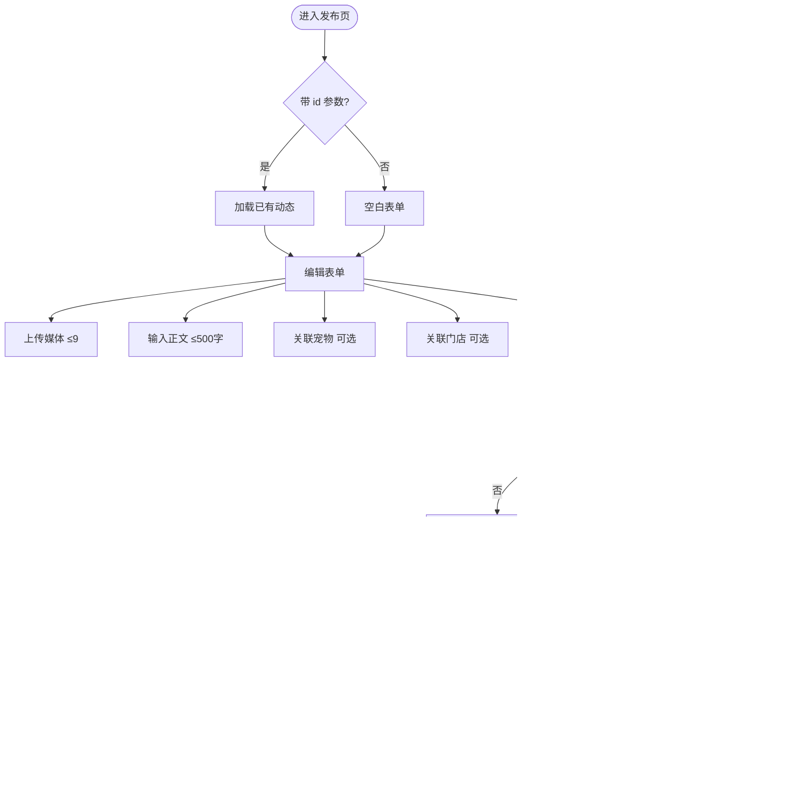
```mermaid
flowchart TD
    Start([进入发布页]) --> EditMode{带 id 参数?}
    EditMode -->|是| LoadPost[加载已有动态]
    EditMode -->|否| Empty[空白表单]
    LoadPost --> Form
    Empty --> Form[编辑表单]

    Form --> Upload[上传媒体 ≤9]
    Form --> Content[输入正文 ≤500字]
    Form --> Pet[关联宠物 可选]
    Form --> Store[关联门店 可选]

    Form --> Submit[点击发布]
    Submit --> Validate{校验通过?}
    Validate -->|否| Toast1[提示：内容/媒体必填等]
    Validate -->|是| Api[提交发布/更新接口]
    Api --> ApiOk{成功?}
    ApiOk -->|否| Toast2[提示错误]
    ApiOk -->|是| Pending[状态：待审核 audit=0]
    Pending --> Mine[我的动态 post/mine]
```

### 5.3 动态审核状态机

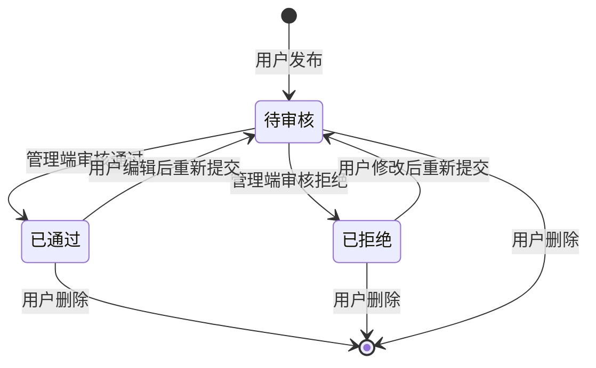
```mermaid
stateDiagram-v2
    [*] --> 待审核: 用户发布
    待审核 --> 已通过: 管理端审核通过
    待审核 --> 已拒绝: 管理端审核拒绝
    已通过 --> 待审核: 用户编辑后重新提交
    已拒绝 --> 待审核: 用户修改后重新提交
    已通过 --> [*]: 用户删除
    已拒绝 --> [*]: 用户删除
    待审核 --> [*]: 用户删除
```

| 状态值 | 含义 | 用户可见行为 |
|--------|------|--------------|
| 0 | 待审核 | 仅自己可见；我的动态 Tab 展示 |
| 1 | 已通过 | 出现在公共朋友圈流 |
| 2 | 已拒绝 | 展示 rejectReason；可编辑重提 |

### 5.4 我的动态管理

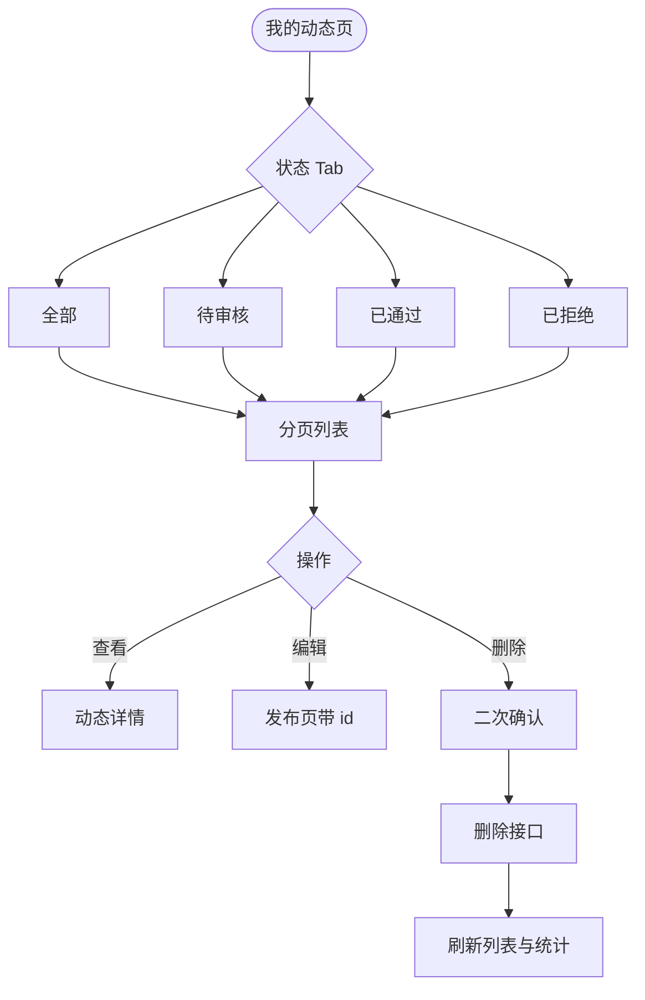
```mermaid
flowchart TD
    Mine([我的动态页]) --> Tabs{状态 Tab}
    Tabs --> All[全部]
    Tabs --> P0[待审核]
    Tabs --> P1[已通过]
    Tabs --> P2[已拒绝]

    All --> List[分页列表]
    P0 --> List
    P1 --> List
    P2 --> List

    List --> ItemOp{操作}
    ItemOp -->|查看| Detail[动态详情]
    ItemOp -->|编辑| Create[发布页带 id]
    ItemOp -->|删除| Confirm[二次确认]
    Confirm --> DelApi[删除接口]
    DelApi --> Refresh[刷新列表与统计]
```

### 5.5 投诉流程

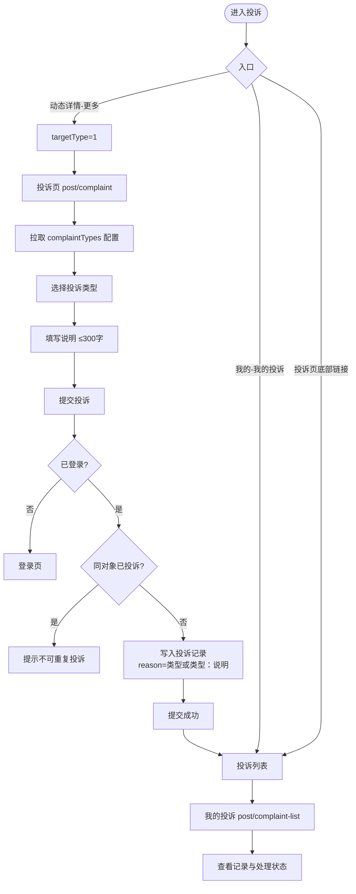
```mermaid
flowchart TD
    Entry([进入投诉]) --> From{入口}
    From -->|动态详情-更多| DetailEntry[targetType=1]
    From -->|我的-我的投诉| ListEntry[投诉列表]
    From -->|投诉页底部链接| ListEntry

    DetailEntry --> Complaint[投诉页 post/complaint]
    Complaint --> LoadTypes[拉取 complaintTypes 配置]
    LoadTypes --> Select[选择投诉类型]
    Select --> Input[填写说明 ≤300字]
    Input --> Submit[提交投诉]
    Submit --> Login{已登录?}
    Login -->|否| LoginPage[登录页]
    Login -->|是| Dup{同对象已投诉?}
    Dup -->|是| Toast1[提示不可重复投诉]
    Dup -->|否| Save[写入投诉记录<br/>reason=类型或类型：说明]
    Save --> Ok[提交成功]
    Ok --> ListEntry

    ListEntry --> ComplaintList[我的投诉 post/complaint-list]
    ComplaintList --> View[查看记录与处理状态]
```

---

## 6. 岛宅流程

### 6.1 岛宅主场景

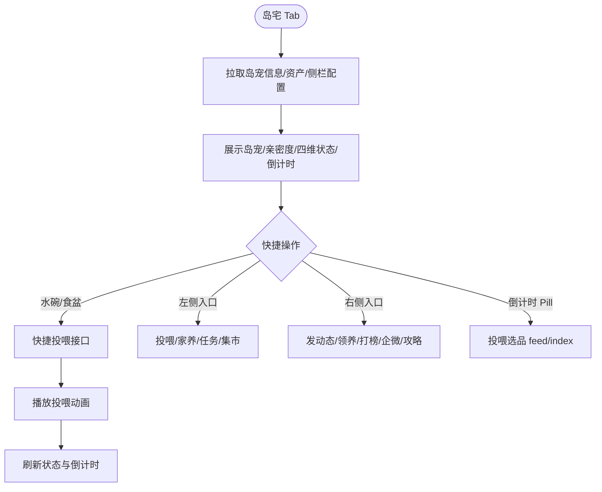
```mermaid
flowchart TD
    Island([岛宅 Tab]) --> Fetch[拉取岛宠信息/资产/侧栏配置]
    Fetch --> Scene[展示岛宠/亲密度/四维状态/倒计时]

    Scene --> Quick{快捷操作}
    Quick -->|水碗/食盆| BowlFeed[快捷投喂接口]
    BowlFeed --> Anim[播放投喂动画]
    Anim --> Update[刷新状态与倒计时]

    Quick -->|左侧入口| LeftMenu[投喂/家养/任务/集市]
    Quick -->|右侧入口| RightMenu[发动态/领养/打榜/企微/攻略]
    Quick -->|倒计时 Pill| FeedPage[投喂选品 feed/index]
```

### 6.2 岛宅养成闭环

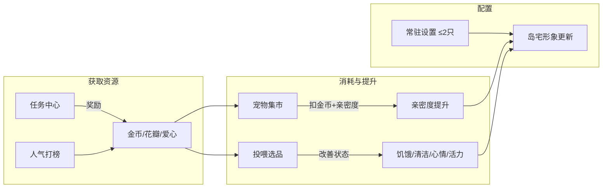
```mermaid
flowchart LR
    subgraph 获取资源
        Task[任务中心] -->|奖励| Asset[金币/花瓣/爱心]
        Rank[人气打榜] --> Asset
    end

    subgraph 消耗与提升
        Asset --> Market[宠物集市]
        Asset --> Feed[投喂选品]
        Market -->|扣金币+亲密度| Intimacy[亲密度提升]
        Feed -->|改善状态| Status[饥饿/清洁/心情/活力]
    end

    subgraph 配置
        Setup[常驻设置 ≤2只] --> Scene[岛宅形象更新]
    end

    Intimacy --> Scene
    Status --> Scene
```

### 6.3 常驻宠物设置

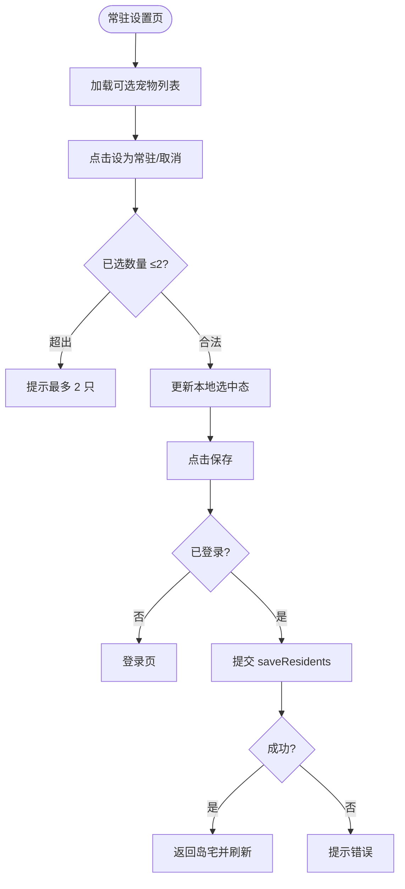
```mermaid
flowchart TD
    Setup([常驻设置页]) --> Load[加载可选宠物列表]
    Load --> Select[点击设为常驻/取消]
    Select --> Count{已选数量 ≤2?}
    Count -->|超出| Toast[提示最多 2 只]
    Count -->|合法| Local[更新本地选中态]
    Local --> Save[点击保存]
    Save --> Login{已登录?}
    Login -->|否| LoginPage[登录页]
    Login -->|是| Api[提交 saveResidents]
    Api --> Ok{成功?}
    Ok -->|是| Back[返回岛宅并刷新]
    Ok -->|否| Toast2[提示错误]
```

### 6.4 任务中心

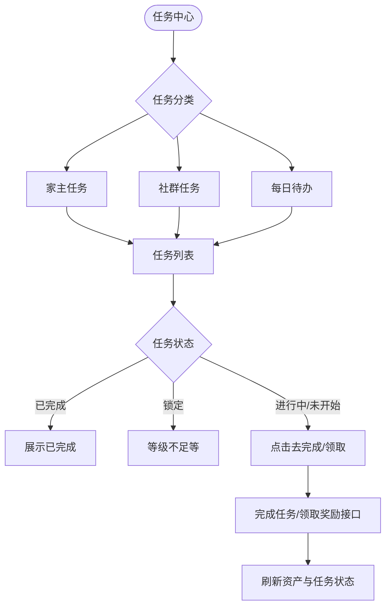
```mermaid
flowchart TD
    Task([任务中心]) --> Tab{任务分类}
    Tab --> Owner[家主任务]
    Tab --> Social[社群任务]
    Tab --> Daily[每日待办]

    Owner --> List[任务列表]
    Social --> List
    Daily --> List

    List --> Status{任务状态}
    Status -->|已完成| Done[展示已完成]
    Status -->|锁定| Locked[等级不足等]
    Status -->|进行中/未开始| Action[点击去完成/领取]
    Action --> Complete[完成任务/领取奖励接口]
    Complete --> Refresh[刷新资产与任务状态]
```

### 6.5 宠物集市购买

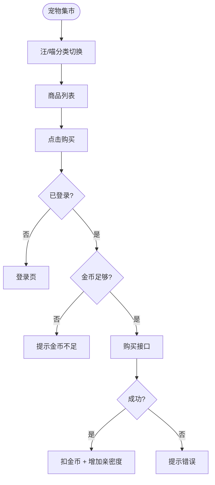
```mermaid
flowchart TD
    Market([宠物集市]) --> Filter[汪/喵分类切换]
    Filter --> Goods[商品列表]
    Goods --> Buy[点击购买]
    Buy --> Login{已登录?}
    Login -->|否| LoginPage[登录页]
    Login -->|是| Coin{金币足够?}
    Coin -->|否| Toast1[提示金币不足]
    Coin -->|是| Api[购买接口]
    Api --> Ok{成功?}
    Ok -->|是| Update[扣金币 + 增加亲密度]
    Ok -->|否| Toast2[提示错误]
```

### 6.6 投喂选品

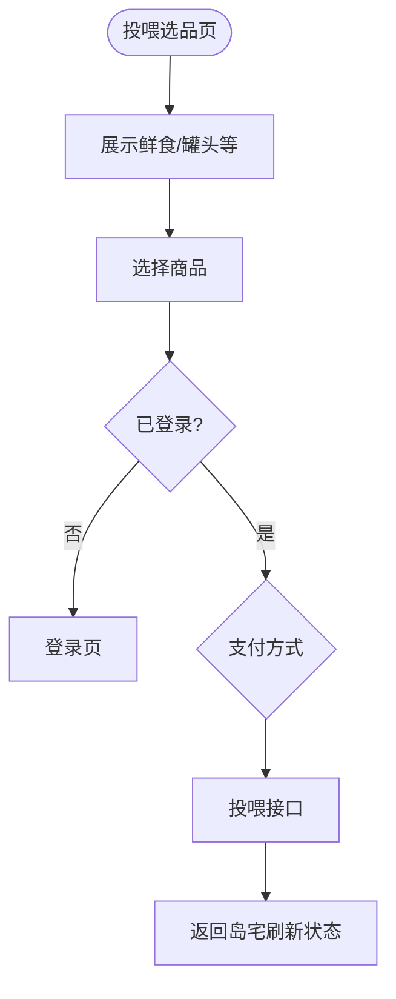
```mermaid
flowchart TD
    Feed([投喂选品页]) --> List[展示鲜食/罐头等]
    List --> Pick[选择商品]
    Pick --> Login{已登录?}
    Login -->|否| LoginPage[登录页]
    Login -->|是| PayOrUse{支付方式}
    PayOrUse --> FeedApi[投喂接口]
    FeedApi --> Island[返回岛宅刷新状态]
```

### 6.7 人气打榜

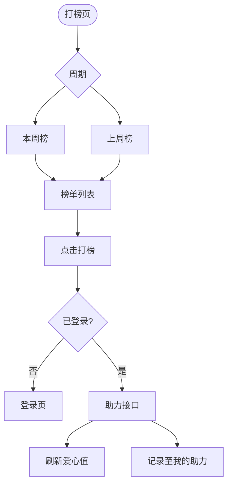
```mermaid
flowchart TD
    Rank([打榜页]) --> Week{周期}
    Week --> This[本周榜]
    Week --> Last[上周榜]
    This --> List[榜单列表]
    Last --> List
    List --> Support[点击打榜]
    Support --> Login{已登录?}
    Login -->|否| LoginPage[登录页]
    Login -->|是| Assist[助力接口]
    Assist --> Refresh[刷新爱心值]
    Assist --> AssistRecord[记录至我的助力]
```

---

## 7. 领养流程

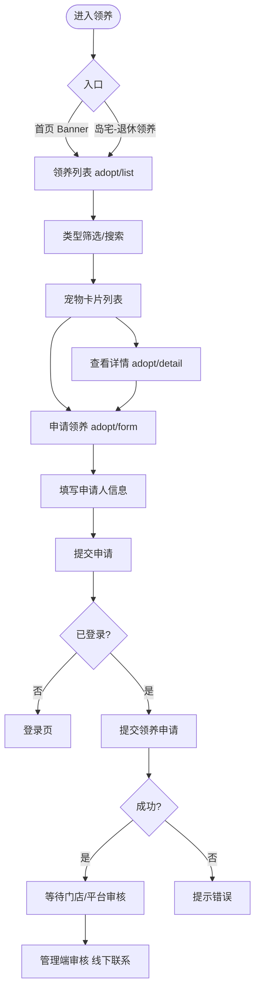
```mermaid
flowchart TD
    Entry([进入领养]) --> From{入口}
    From -->|首页 Banner| List
    From -->|岛宅-退休领养| List
    List[领养列表 adopt/list] --> Filter[类型筛选/搜索]
    Filter --> Cards[宠物卡片列表]

    Cards --> Detail[查看详情 adopt/detail]
    Cards --> Apply[申请领养 adopt/form]

    Detail --> Apply
    Apply --> Fill[填写申请人信息]
    Fill --> Submit[提交申请]
    Submit --> Login{已登录?}
    Login -->|否| LoginPage[登录页]
    Login -->|是| Api[提交领养申请]
    Api --> Result{成功?}
    Result -->|是| Wait[等待门店/平台审核]
    Result -->|否| Toast[提示错误]

    Wait --> AdminReview[管理端审核 线下联系]
```

---

## 8. 门店探索流程

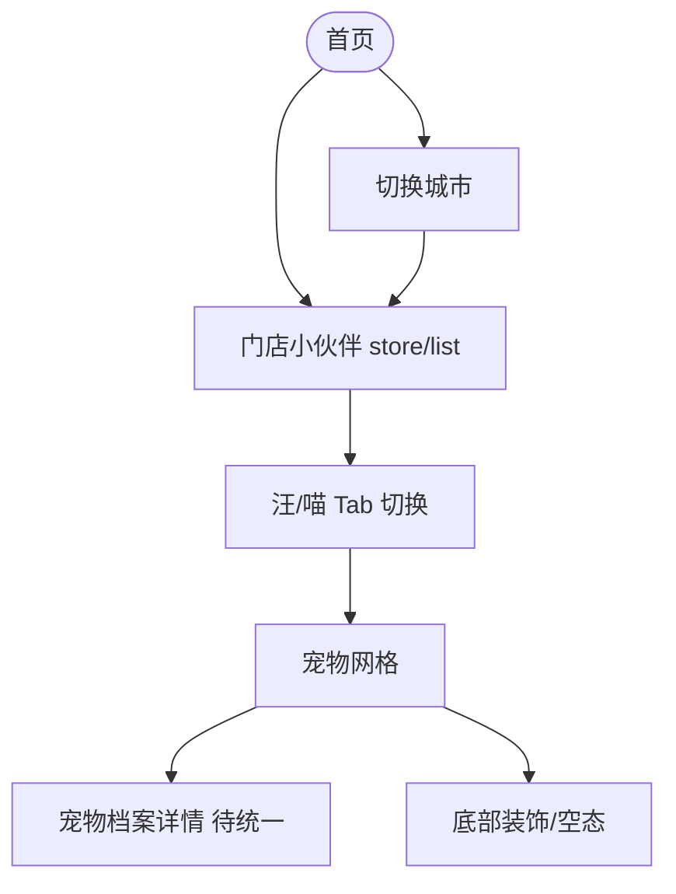
```mermaid
flowchart TD
    Home([首页]) --> StoreList[门店小伙伴 store/list]
    StoreList --> Type[汪/喵 Tab 切换]
    Type --> Grid[宠物网格]
    Grid --> Detail[宠物档案详情 待统一]
    Grid --> Foot[底部装饰/空态]

    Home --> City[切换城市]
    City --> StoreList
```

---

## 9. 商城流程

### 9.1 商品浏览

```mermaid
flowchart TD
    Shop([商城 Tab]) --> Banner[轮播 Banner 可选]
    Shop --> Cats[分类 Tab 切换]
    Cats --> Products[双列商品列表]
    Products --> Detail[商品详情 product/detail]
    Shop --> ExchangeEntry[积分兑换区入口]
    ExchangeEntry --> ExchangeList[兑换记录 exchange/list]
```

### 9.2 购买与支付

```mermaid
flowchart TD
    Detail([商品详情]) --> Spec[选择规格]
    Spec --> BuyChoice{购买方式}

    BuyChoice -->|立即购买| Cash[创建现金订单]
    BuyChoice -->|积分兑换| Point{积分足够?}
    Point -->|否| Toast1[提示积分不足]
    Point -->|是| PointOrder[创建积分订单]

    Cash --> Login{已登录?}
    PointOrder --> Login
    Login -->|否| LoginPage[登录页]

    Cash --> WxPay[唤起微信支付]
    WxPay --> PayResult{支付结果}
    PayResult -->|成功| Success[支付结果页 payment/result]
    PayResult -->|失败/取消| Fail[结果页/Toast]
    PayResult -->|处理中| Poll[轮询支付状态]

    PointOrder --> PointOk{兑换成功?}
    PointOk -->|是| Success
    PointOk -->|否| Toast2[提示错误]
```

### 9.3 支付结果页

```mermaid
flowchart TD
    Result([支付结果页]) --> Status{结果状态}
    Status -->|成功| ShowOk[展示成功 + 订单信息]
    Status -->|失败| ShowFail[展示失败 + 重试引导]
    ShowOk --> Back[返回商城/订单]
    ShowFail --> Retry[重新购买]
```

---

## 10. 我的（个人中心）流程

### 10.1 我的页主流程

```mermaid
flowchart TD
    My([我的 Tab]) --> Auth{已登录?}
    Auth -->|否| Guest[展示立即登录]
    Guest --> Login[登录页]
    Auth -->|是| Profile[头像/昵称/ID/等级/资产]

    Profile --> Featured[我发布的朋友圈]
    Featured --> PostMine[我的动态 post/mine]

    Profile --> Menu{功能菜单}
    Menu --> Assist[我的助力 assist/list]
    Menu --> Gift[赠送视频反馈 gift/list]
    Menu --> Coupon[我的券包 coupon/list]
    Menu --> Exchange[周边兑换记录 exchange/list]
    Menu --> Complaint[我的投诉 complaint-list]
    Menu --> Settings[设置 settings/index]
```

### 10.2 资料编辑

```mermaid
flowchart TD
    Settings([设置页]) --> Edit[编辑资料弹窗]
    Edit --> Avatar[更换头像 upload]
    Edit --> Nick[修改昵称]
    Edit --> Birthday[选择生日]
    Edit --> Save[保存]
    Save --> Api[更新用户信息接口]
    Api --> Ok{成功?}
    Ok -->|是| Refresh[刷新我的页/设置页]
    Ok -->|否| Toast[提示错误]
```

### 10.3 通知开关

```mermaid
flowchart TD
    Settings --> Switch[通知 Switch 列表]
    Switch --> Toggle[切换开关]
    Toggle --> Api[保存通知配置]
    Api --> Local[更新本地展示]
```

---

## 11. 运营与内容流程

### 11.1 企微/社群

```mermaid
flowchart TD
    Entry([入口]) --> From{来源}
    From -->|首页-加入社群| Wecom
    From -->|岛宅-添加企微| Wecom
    From -->|设置-联系客服| Wecom
    Wecom[企微页 wecom/index] --> QR[展示二维码/引导文案]
    QR --> Scan[用户扫码添加]
```

### 11.2 养宠攻略

```mermaid
flowchart TD
    Entry([入口]) --> From{来源}
    From -->|岛宅-攻略| Strategy
    Strategy[strategy/list] --> List[攻略文章列表]
    List --> Read[点击阅读 详情页待补充]
```

---

## 12. 跨模块关联流程

### 12.1 新用户首次体验路径（推荐）

```mermaid
flowchart LR
    A[打开 App] --> B[探索首页]
    B --> C[浏览门店]
    C --> D[朋友圈浏览]
    D --> E{产生互动?}
    E -->|是| F[登录]
    F --> G[点赞/评论/发布]
    E -->|否| H[岛宅体验]
    H --> F
```

### 12.2 资产流转总图

```mermaid
flowchart TD
    subgraph 产出
        T[完成任务] --> P[花瓣积分 points]
        T --> C[金币 coins]
        T --> L[爱心值 love]
        R[打榜助力] --> L
    end

    subgraph 消耗
        P --> EX[周边积分兑换]
        C --> MK[集市道具]
        P --> PR[商城积分购]
        C --> FD[投喂消费]
    end

    subgraph 展示
        P --> ShopShow[商城页展示]
        C --> IslandShow[岛宅/集市展示]
        L --> IslandShow
    end
```

---

## 13. 异常与边界流程

### 13.1 网络异常

```mermaid
flowchart TD
    Request([发起 API 请求]) --> Net{请求结果}
    Net -->|超时/断网| Toast[Toast 网络异常]
    Net -->|业务错误| BizToast[Toast msg]
    Net -->|成功| Render[正常渲染]
    Net -->|失败且有 Mock| Mock[本地 Mock 兜底<br/>首页/部分列表]
```

### 13.2 空状态

| 页面 | 空状态文案/行为 |
|------|----------------|
| 朋友圈 | 「暂无动态」 |
| 我的动态 | 各 Tab count=0 |
| 评论 | 「暂无评论，来抢沙发吧」 |
| 互动消息 | 「暂无消息」 |
| 门店小伙伴 | 「暂无小伙伴」 |
| 领养列表 | 「暂无等待领养的退役宠物」 |

### 13.3 权限与操作限制

| 场景 | 处理方式 |
|------|----------|
| 未登录操作 | 跳转登录页 |
| 动态禁止点赞/评论 | 按钮 disabled |
| 重复投诉同一对象 | 接口拒绝 + Toast |
| 常驻宠物超过 2 只 | 前端提示，不允许保存 |
| 金币/积分不足 | 购买/兑换前拦截 |

---

## 14. 流程与需求编号对照

| 流程章节 | 需求文档章节 | 关键编号 |
|----------|--------------|----------|
| §3 账号体系 | §3.6 | A-01 ~ A-05 |
| §4 探索首页 | §3.1 | H-01 ~ H-07 |
| §5 朋友圈 | §3.2、§3.9 | M-01 ~ M-08, P-01 ~ C-05 |
| §6 岛宅 | §3.3、§3.10 | I-01 ~ I-07, T-01 ~ R-04 |
| §7 领养 | §3.7 | AD-01 ~ AD-05 |
| §8 门店 | §3.8 | ST-01 ~ ST-03 |
| §9 商城 | §3.4、§3.11 | S-01 ~ S-06, PR-01 ~ EX-03 |
| §10 我的 | §3.5、§3.12 | U-01 ~ U-05, SET-01 ~ SET-07 |

---

## 15. 测试验收流程建议

以下路径建议作为 E2E 验收最小集：

| 序号 | 流程 | 关键断言 |
|------|------|----------|
| 1 | 密码登录 → 我的页展示资产 | token 写入，昵称展示 |
| 2 | 朋友圈发布 → 我的动态待审核 | audit=0，统计 +1 |
| 3 | 动态详情点赞/评论 | 计数变化，重复操作幂等 |
| 4 | 投诉提交 → 我的投诉列表 | 不可重复投诉 |
| 5 | 岛宅投喂 → 状态/倒计时更新 | 接口成功，UI 动画 |
| 6 | 集市购买 → 金币减少 | 亲密度增加 |
| 7 | 商城购买 → 支付结果页 | 订单状态正确 |
| 8 | 领养申请提交 | 表单校验 + 成功提示 |
| 9 | 设置编辑资料 → 我的页同步 | 昵称/头像更新 |
| 10 | 退出登录 → 需登录操作拦截 | 跳转登录页 |

---

*本文档与 [需求文档.md](./需求文档.md) 配套维护；页面或接口变更时请同步更新流程图与状态说明。*
